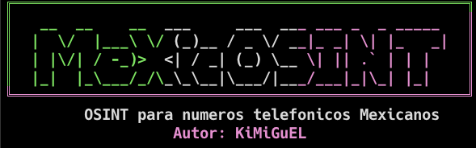

## Tabla de Contenidos
- [Instalación](#instalación)
- [Uso](#uso)
- [Módulos](#módulos)
- [Dependencias](#dependencias)
- [Nota](#nota)

# MeXiCOSINT

Herramienta de OSINT para numeros telefonicos Mexicanos.

## Instalacion

git clone https://github.com/metalpunx666/MeXiCOSINT.git
cd MeXiCOSINT
python3 -m venv venv
source venv/bin/activate
pip install -r requirements.txt

## Uso

python3 mexicosint_v2.2.5.py

## Modulos

- local_parser.py - Validacion y parsing de numeros mexicanos
- quienhabla.py - Integracion con QuienHabla.mx
- ift_sns.py - Procesamiento de datos IFT/SNS

## Dependencias

requests, beautifulsoup4, phonenumbers, python-dotenv, lxml

## Nota

No subas tu .env al repositorio.
